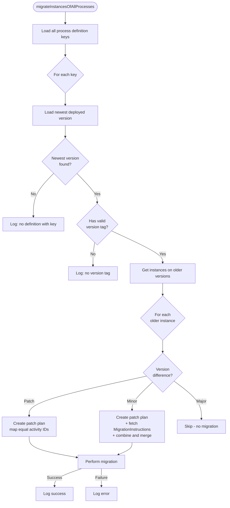

# Camunda Process Instance Migrator

This tool will allow you to automatically or semi-automatically migrate all of your Camunda Process
Instances whenever you release a new version.

## What does this library add on top of Camunda's migration API?

Camunda 7 provides a low-level [Migration API](https://docs.camunda.org/manual/latest/user-guide/process-engine/process-instance-migration/)
that requires you to manually construct a migration plan for a specific source and target process
definition ID, then execute it instance by instance. This library builds a fully automated
migration layer on top of that API:

- **Automatic process definition discovery** — scans the engine for all deployed process definition
  keys without any configuration
- **Automatic newest-version detection** — identifies the latest deployed version per key using
  semantic version tags (`MAJOR.MINOR.PATCH`), rather than Camunda's internal deployment order
- **Automatic eligible-instance discovery** — finds all running instances on older versions that
  are candidates for migration, excluding pre-release (`0.x.x`) and unversioned definitions
- **Zero-config patch migrations** — automatically generates a migration plan by mapping equal
  activity IDs (`mapEqualActivities`) for patch-level version differences, with no manual
  instruction authoring required
- **Instruction chaining for minor migrations** — accepts step-by-step minor migration instructions
  (e.g. `1.0→1.1` and `1.1→1.2`) and automatically chains them into a single combined plan when
  an instance needs to cross multiple minor versions in one step
- **Major version safety** — automatically skips migration for instances whose source version
  differs in major version from the newest, preventing unintended migrations
- **Pluggable architecture** — every component (instance discovery, plan creation, instruction
  source, logging, execution) is behind an interface and can be replaced with a custom
  implementation via the fluent builder

## Why should I use this?

If you develop Process Models in an agile environment, these models will change regularly. As soon
as the resulting process definitions are instantiated, be it in a test- or productive environment,
you would be advised to migrate these created Process Instances whenever a new process definition is
released.
This is for two reasons:

1. Without migration your process instances will not gain the features added in the new release
2. Without migration, you are forced to maintain the existing Java API: you may not rename Java
   Delegates or change the signature of called Bean's methods.

## How does it work?

The migrator scans the Camunda engine for all deployed process definition keys, finds running
instances on older versions, and attempts to migrate them to the newest deployed version.



### Versioning semantics

All process models must use the `Version Tag` property with the format `MAJOR.MINOR.PATCH`
(e.g. `1.0.0`):

| Version level | When to increase | Migration behavior |
|---|---|---|
| **Patch** | Simple changes: rename/add activities, change Java delegates | Automatic — equal activity IDs are mapped |
| **Minor** | Wait-state ID changes, wait-state removals, activities moved into subprocesses | Requires custom `MigrationInstructions` |
| **Major** | Breaking changes where no migration is wanted | No migration attempted |

Notes:
- Process definitions with a missing or malformed version tag are excluded from migration
- Process definitions with major version `0` (e.g. `0.0.1`) are excluded from migration

## How do I use this?

### Add the dependency

```xml
<dependency>
  <groupId>de.envite.bpm</groupId>
  <artifactId>camunda-process-instance-migrator</artifactId>
  <version>2.1.0</version>
</dependency>
```

Please check https://central.sonatype.com/artifact/de.envite.bpm/camunda-process-instance-migrator
for the latest version.

### Basic setup (patch-only migrations)

Inject Camunda's `ProcessEngine` and build the migrator. No further configuration is required for
patch-level migrations:

```java
@Configuration
public class MigratorConfiguration {

  @Autowired
  private ProcessEngine processEngine;

  @Bean
  public ProcessInstanceMigrator processInstanceMigrator() {
    return ProcessInstanceMigrator.builder()
        .ofProcessEngine(processEngine)
        .build();
  }

}
```

You may then use the `ProcessInstanceMigrator` bean to manually trigger migration (e.g. via a
REST endpoint), or automatically on each deployment via `@PostConstruct` or `ApplicationReadyEvent`:

```java
@Component
public class OnStartupMigrator {

  @Autowired
  private ProcessInstanceMigrator processInstanceMigrator;

  @EventListener(ApplicationReadyEvent.class)
  public void migrateAllProcessInstances() {
    processInstanceMigrator.migrateInstancesOfAllProcesses();
  }
}
```

### Minor migrations

Whenever a wait-state activity is removed or its ID is changed, you must supply migration
instructions so the migrator knows how to remap the old activity IDs to the new ones:

```java
@Configuration
public class MigratorConfiguration {

  @Autowired
  private ProcessEngine processEngine;

  @Bean
  public ProcessInstanceMigrator processInstanceMigrator() {
    return ProcessInstanceMigrator.builder()
        .ofProcessEngine(processEngine)
        .withMigrationInstructions(generateMigrationInstructions())
        .build();
  }

  private MigrationInstructions generateMigrationInstructions() {
    return new MigrationInstructionsDefaultImpl()
        .putInstructions("Some_process_definition_key", Arrays.asList(
            MinorMigrationInstructions.builder()
                .sourceMinorVersion(0)
                .targetMinorVersion(2)
                .majorVersion(1)
                .migrationInstructions(Arrays.asList(
                    new MigrationInstructionImpl("UserTask1", "UserTask3"),
                    new MigrationInstructionImpl("UserTask2", "UserTask3")))
                .build()));
  }
}
```

Each `putInstructions` call defines a migration path for one specific process key and version range
(here: from `1.0.x` to `1.2.x`). You may also break it up into smaller steps (`1.0.x → 1.1.x` and
`1.1.x → 1.2.x`) — the migrator will chain them automatically.

There is no requirement for all intermediate versions to actually be deployed on the target
environment. If a production environment jumps from `1.5.x` to `1.8.x` (skipping intermediate
versions), instructions for `1.5→1.6`, `1.6→1.7`, and `1.7→1.8` are sufficient.

### Migration properties

You can configure the migration behavior per process definition key using `MigrationProperties`:

```java
@Bean
public ProcessInstanceMigrator processInstanceMigrator() {
  MigrationProperties properties = new MigrationPropertiesDefaultImpl()
      .putSkipCustomListeners("Some_process_definition_key", true)   // default: true
      .putSkipIoMappings("Some_process_definition_key", true)        // default: true
      .putExecuteAsync("Some_process_definition_key", false);        // default: false

  return ProcessInstanceMigrator.builder()
      .ofProcessEngine(processEngine)
      .withMigrationProperties(properties)
      .build();
}
```

## I need adjustments! What can I do?

Of course, you can always submit issues or create a pull request. But if you are looking for a quick
change in functionality, it is recommended that you create your own implementation of the interfaces
that provide the migrator's functionality. If, for example, you want to provide minor migration
instructions via a JSON file, or you wish to modify logging, provide your own implementation:

```java
@Bean
public ProcessInstanceMigrator processInstanceMigrator() {
  return ProcessInstanceMigrator.builder()
      .ofProcessEngine(processEngine)
      //CustomJsonMigrationInstructionReader implements MigrationInstructions
      .withMigrationInstructions(new CustomJsonMigrationInstructionReader())
      //CustomMigratorLogger implements MigratorLogger
      .withMigratorLogger(new CustomMigratorLogger())
      .build();
}
```

All major components are behind interfaces with default implementations that can be swapped via the
builder:

| Builder method | Interface | Purpose |
|---|---|---|
| `withMigrationInstructions` | `MigrationInstructions` | Source for minor migration instructions |
| `withMigrationProperties` | `MigrationProperties` | Migration execution options per key |
| `withMigratorLogger` | `MigratorLogger` | Log migration results |
| `withGetOlderProcessInstances` | `GetOlderProcessInstances` | Find instances eligible for migration |
| `withCreatePatchMigrationplanToSet` | `CreatePatchMigrationplan` | Create patch-level migration plans |
| `withLoadProcessDefinitionKeys` | `LoadProcessDefinitionKeys` | Discover all process definition keys |
| `withLoadNewestDeployedVersion` | `LoadNewestDeployedVersion` | Find the newest deployed version per key |
| `withGenerateAllInstancesLoggingData` | `GenerateAllInstancesLoggingData` | Aggregate logging data |

## What limitations are there?

The tool was developed against Camunda Platform 7 and is tested with Camunda `7.24.0`. It may not
work with older versions of Camunda, and is not compatible with Camunda Platform 8.

Requires Java 17.

There are also no restrictions to the specifiable migration instructions for minor migrations,
unlike in the migration wizard of Camunda's EE Cockpit. So this migrator will not prevent you from
trying to migrate activities to different types of activities (i.e. from wait-states to
non-wait-states or from receive tasks to user tasks). This might, however, result in undefined states
and has not been tested whatsoever. So handle with care!

Operations that go beyond migration, like Process Instance Modifications or the setting of variables
upon migration are also not implemented yet.

## What else do I need to know?

Firstly, migration of process instances takes "real" time. Migrating thousands of Process Instances
may take several minutes. So it is advisable to carry out the migration asynchronously (see
`putExecuteAsync` in [Migration properties](#migration-properties)).

Secondly, the migrator was built to be robust and informative. Any action the migrator takes will be
logged, and any issue that may come up during migration, will just cause the migration of that
specific process instance to fail and be logged accordingly. So it is advised to check your logs
after each migration for faulty process instances. It is very rare that a migration attempt fails,
but when it does, you may want to correct it manually.

## Can I contribute?

Of course! Add an issue, submit a pull request. We will be happy to extend the tool with your help.
